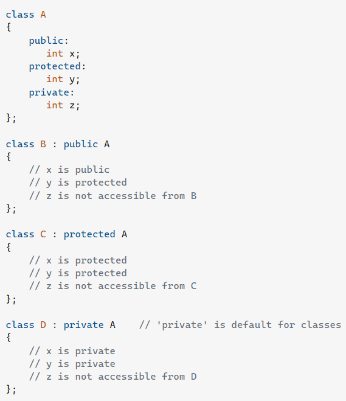
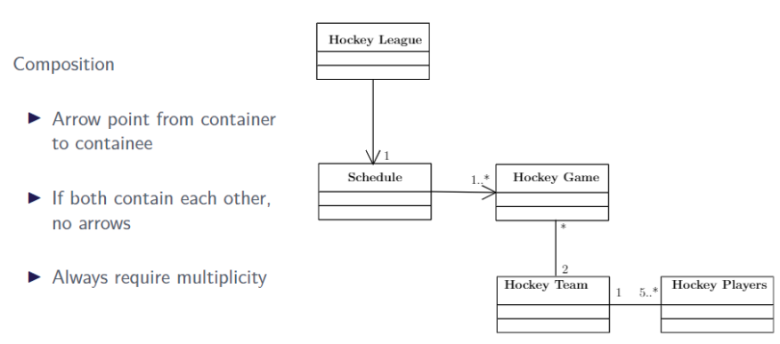
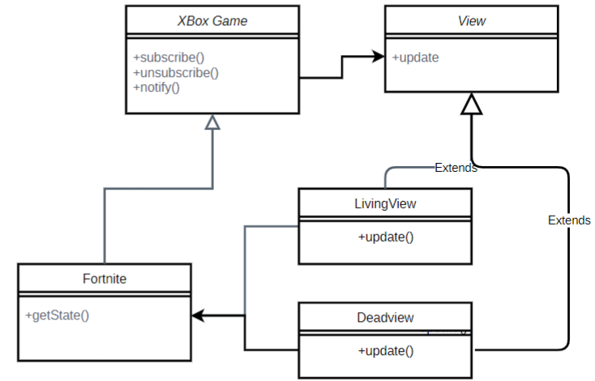

### 1. Inheritance - Access Modifiers

```cpp
class Car {
    public:
        int wheels;
    protected:
        int doors;
    private:
        int pistons;
}

class Electric: public Car{};

class Tesla: public Electric{
    public:
        void upgrade(){
            // code goes here
        }
}

int main(){
    Tesla ts;
    return 0;
}
```

- Electric publicly inherits from Car, Tesla Publicly inherited from Electric, in public inheritance all public members of the base class become public members of the derived class, all protected members of the base class become protected members of the derived class, and all private members of the base class are inaccessible in the derived class

- **Wheels:**
    - Since wheels is a public member of Car, it is accessible in its derived classes as well as anywhere else in the program.

- **Doors:**
    - Since doors is a protected member of Car, it is accessible in its derived classes but not outside of the class. So in the upgrade function but not in main.

- **Pistons:**
    - Since pistons is a private member of Car, it is not accessible in its derived classes or anywhere else in the program.

____

**Public Inheritance:** In public inheritance, the public members of the base class become public members of the derived class and protected members of the base class become protected members of the derived class. The private members of the base class are not accessible in the derived class. 

- Private base class members can only be accessed through public or protected member functions I or friend classes and friend functions.

**Protected Inheritance**: In protected inheritance, the public members of the base class become protected members of the derived class and protected members of the base class become protected members of the derived class. The private members of the base class are not accessible in the derived class.

**Private Inheritance:** In private inheritance, the public and protected members of the base class become private members of the derived class. The private members of the base class are not accessible in the derived class. And derived class of the derived class can't access the base class members.



____

### 2. Exceptions - Try, Catch, Throw

```cpp
class Animal{};
class Bird: public Animal{};
class Chicken: public Bird{};
class Cat: public Animal{};
class Pig: public Animal{};

int main(){
    try {
        throw pig();
    } catch(bird& a){
        cout << "Caught a bird" << endl;
    } catch(Chichen& c){
        cout << "Caught a chicken" << endl;
    } catch(Animal& a){
        cout << "Caught an animal" << endl;
    } catch(Pig& p){
        cout << "Caught a pig" << endl;
    } catch(...){ // lets say we threw a string, catch all other exceptions
        cout << "Caught something else" << endl;
    }
}
```

- Here if we throw a pig object, the catch block that will be executed is the one that catches an Animal object. This is because the catch block that catches an Animal object is the first catch block that can catch a Pig object. The catch block that catches a Pig object is the last catch block that can catch a Pig object.

____

```cpp
function1(){
    cout <<"hi">>
    throw 20;
    cout << "bye";
}

function2(){
    try{
        function1();
    } catch(string x){
        cout << x;
    } catch(int x){
        // throw an exception
        throw;
    }
}

int main(){
    try{
        function2();
    } catch(int x){
        cout << x;
    }
}
```
- The output here would be "hi20" because the function1() throws an exception of type int, which is caught by the catch block in function2(). The catch block in function2() throws the exception again, which is caught by the catch block in main().

- When an exception is thrown in a catch block any code under the throw statement is not executed.

____

### Copy Constructores - Deep Copy

```cpp
class Episode{
    public:
        Episode(const string& name, const string& captions);
    private:
        string name;
        string captions;
};

class Show {
    public:
        Show(const string& name): name(name), numEpisodes(0), episodes(new Episode*[256]){}
        Show(Show& show);
        void addEpisode(const string& name, const string& captions) {
            episodes[numEpisodes++] = new Episode(name, captions);
        }
    private:
        string name;
        Episode** episodes; // dynamically allocated arr of episode pointers
        int numEpisodes;
};
```

- Write the deep copy constructor for the show class: (Deep Copy)
    - A deep copy is a copy of an object that also copies the objects that the object points to. In this case, the Show class has a dynamically allocated array of Episode pointers. When a Show object is copied, the new Show object should have a new dynamically allocated array of Episode pointers that are copies of the Episode objects that the original Show object points to.

```cpp
Show (Show& s) {
    name = s.name; // initialize the name to the name of the show being copied
    numEpisodes = s.numEpisodes; // initialize # of episodes to # of episodes of show being copied
    episodes = new Episode*[256]; // initialize a dynamically allocated arr of episode pointers.
    for (int i = 0; i < numEpisodes; i++) { // loop through each episode of the show being copied
        episodes[i] = new Episode(*s.episodes[i]);
    }
}
```
____

### 3. Constructors and Destructors in Inheritance

```cpp
using namespace std

class Animal{
    public:
        Animal(){cout << "Animal ctor" << endl;}
        ~Animal(){cout << "Animal dtor" << endl;}
};

class Bird: public Animal{
    public:
        Bird(){cout << "Bird ctor" << endl;}
        ~Bird(){cout << "Bird dtor" << endl;}
};

int main(){
    Animal animal;
    Bird bird;
}
```

The output of this code would be:
- Animal ctor - When the Animal object is created. the Animal constructor is called.
- Animal ctor -  When the Bird object is created, the Animal constructor is called first as bird inherits from Animal.
- Bird ctor - Then the bird constructor is called.
- Bird dtor - Then the bird destructor is called, as it objects are destroyed in the reverse order they are created.
- Animal dtor - Finally the animal destructor is called for the bird object.
- Animal dtor - Finally the animal destructor is called for the animal object.
____
- Another example:
```cpp

using namespace std
class Animal{
    public:
        Animal(){cout << "Animal ctor" << endl;}
        ~Animal(){cout << "Animal dtor" << endl;}
};

class Bird: public Animal{
    public:
        Bird(){cout << "Bird ctor" << endl;}
        ~Bird(){cout << "Bird dtor" << endl;}
        Egg egg; // Bird has an egg
};

class Egg() {
    public:
        Egg(){cout << "Egg ctor" << endl;}
        ~Egg(){cout << "Egg dtor" << endl;}
};

int main(){
    Animal animal;
    Bird bird;
}

```

The output of this code would be:

-   Animal ctor - When the Animal object is created, the Animal constructor is called.
- Animal ctor - When the Bird object is created, the Animal constructor is called first as bird inherits from Animal.
- Egg ctor - Then the Egg constructor is called, as the Bird object has an Egg object as a member variable but it is created after the Animal constructor is called. But before the bird constructor is called. (If Egg was a pointer no constructor would be called).
- Bird ctor - Then the bird constructor is called After the egg constructor and the inherited animal constructor.
- Bird dtor - Then the bird destructor is called, as objects are destroyed in the reverse order they are created.
- Egg dtor - Then the egg destructor is called, as the egg object is destroyed before the bird object.
- Animal dtor - Finally the animal destructor is called for the bird object.
- Animal dtor - Finally the animal destructor is called for the animal object.
____

In general, the order is:

1. Constructor of Contained class of Base class (Pointer does not call the constructor)
2. Constructor of Base class
3. Constructor of Contained class of derived class (Pointer does not call the constructor)
4. Constructor of Derived class
5. Destructor of 4,3,2,1 (reverse order).
_____
### 4. Cascading

- Cascading is a technique in which multiple operators are chained together in a single statement. This is done by returning a reference to the object being operated on from the operator function.

i.e.
```cpp
int main(){
    Date date;
    date.setDay(1).setMonth(12).setYear(2020);
}
```

- Example without cascading:
```cpp
class Date {
    public:
        Date(int = 1901, int = 1, int = 1);
        Date(Date&);
        // setters
        void setDay(int);
        void setMonth(int);
        void setYear(int);
    private:
        int day, month, year;
};
```
- How would I change the above function signature and write the setters to implement cascading in the date class?
    - return a reference to the object being operated on from the setter functions.

```cpp
class Date {
    public:
        Date(int = 1901, int = 1, int = 1);
        Date(Date&);
        // setters
        Date& setDay(int);
        Date& setMonth(int);
        Date& setYear(int);
    private:
        int day, month, year;

    Date& Date::setDay(int d){
        day = d;
        return *this;
    }   
};
```
____
### 5. Daimond Heirarchy - Multiple Inheritance


- If virtual inheritence is not used then the derived class will have two copies of the base class. This is called the diamond problem.


**Virtual Inheritance**: In virtual inheritance, the derived classes share the same base class. Virtual inheritance is a technique that states that only one instance of a base class can be present at a time.

**Virtual Inheritance is not used:**

- As seen here we have multiple copies of the base class. The goat side has a name and the human side will have another name. This is a problem because the derived class will have two copies of the base class. This is called the diamond problem.

- If asked how many member variables does a centaur have if virtual inheritence is not used then the answer would be 4, instead of 3. This is because the centaur has two copies of the base class.

- If virtual inheritence is not used the both the human and Goat class will call the animal constructor. But the centaur will only call the human and goat constructor. This is because the animal constructor is already called twice. If Virtual Inheritance is used the centaur will call the animal constructor.
____
**Virtual Inheritance is used:**

- If virtual inheritence is used then the derived classes will share the same base class. This is called virtual inheritence. So there will be 3 member variables in the centaur class.

- In Virtual inheritence we must explicitly call every base class constuctor in the heirarchy.
____
**Virtual Inheritance Implementation:**

- refer to p5-mult folder for the implementation of the diamond heirarchy using virtual inheritance.
____

### 6. Operator Overloading (Global and Member Functions)

```cpp
class Time{
    public:
        Time(int=0, int=0, int=0);
    private:
        int seconds, minutes, hours;
        int convertToSeconds();
}
```
How would you implement the + operator for this class? What if we wanted to implement the == operator? What if we alsow anted to compare the Time classs to an int used the == operator?

```cpp
// Member function
Time Time::operator+(Time& t){
    int totalSeconds = convertToSeconds() + t.convertToSeconds();
    return Time(totalSeconds/3600, (totalSeconds%3600)/60, totalSeconds%60);
}
```

- For the + operator, we want to return by value so we can return a new Time object. We want to return a new Time object because we are adding two Time objects together and creating a new Time object.

**Operator Overloading - Member vs Global Functions:**

- Global function - a global function must be used when the left operand is not a Time object. Both parameters are passed as arguments.

```cpp
// i.e. if (200 == time1){} (Here must be a global function because the left operand is an int)

Time operator==(int x, Time& t){
    return t.convertToSeconds() == x;
}
```

- Member function - a member function is used when the left operand is a Time object. Only the right operand is passed as an argument.

```cpp
// i.e. if (time1 == 200){} or if (time1 == time2){}

bool Time::operator==(int x){
    return convertToSeconds() == x;
}
```

**Operator return values*:*
- (=) or (+=) or (>>) or (<<): For the assignment operator we want to **return a reference to the object being assigned to**. This is because we want to be able to chain assignment operators together.
- (+) or (-): For the + operator we want to **return by value** so we can return a new Time object. We want to return a new Time object because we are adding two Time objects together and creating a new Time object.
- (==): For the == operator we want to **return a bool value**. This is because we are comparing two Time objects and want to return a bool value.
____

### 7. What type of information is shown in a UML diagram? What type of information is not shown?

UML Diagrams (Unified Modelling Language):
- Family of notations used to represent OO models
- Communication tool for developers
- Programming language independent
    - A design expressed in UML can be implemented in any OO language

Types of UML Diagrams:

- UML Class Diagrams: Shows attributes and operations of a class and associations between classes


- UML activity/sequence diagram: Behavioural diagrams that show the flow of control between objects


UML CLASS DIAGRAMS

- Attributes
    - Generic term got instance variables, member variables, etc.

- Operations
    - Generic Term for member functions, methods, etc.

- Access Specifiers for attributes and operations
    - "-" means private
    - "#" means Protected
    - "+" means public


- Abstract classes and methods are shown in italics
- Static members are underlined


member functions are shown in the format:
- [access modifier]name(in or out or inout parameter name: parameter type): return type


Associations model two main relationships between classes:

**- Composition: A strong relationship where one class is part of another class (Has-A relationship)**



**Important convention:**
- We do not explicitly show Collection classes. These are implied using the multiplicity indicators

- **Inheritance: A relationship where one class is a specialized version of another class (Is-A relationship)**

- Inheritance ”triangle” points to super class, 
Example: 


**Do not show in UML Specifications:**

- Constructors and destructors
- Getter and Setters
- Collections Classes

Do NOT list object member variables with class attributes!
Show them as their own class using composition and a multiplicity indicator.
____
### 8. Design Patterns
___

**Design Patterns:** A way of organizing code to address a common problem.

Organized via:
- Inheritance and/or polymorphism
- Delegation via composition, or composition alone
- Certain operations to be implemented
- etc...

Some problems recur over and over
- Over time, different programmers noticed they arrived at the same solutions.
___
**Types of Design Patterns:**
- Creational
- Structural
- Behavioural
- Architectural

___
**Client class**:
- The client class is class that uses the design pattern

___
**Creational**:
- Specify how to create objects
- Factory, Abstract factory, singleton, etc...
- Sometimes constructors are problematic
___
**Structural**:
- How objects relate. i.e. composition, inheritance, etc...
- Facade, Bridge, Decorator, Proxy, etc...
___
**Behavioural**:
- Specify how objects interact (which object call which)
- Observer, Strategy, Visitor etc...

___
**Architectural**: (Arguable not a design pattern)
- How objects are grouped into subsystems (group of classes that work together).
- Different from structural patterns because it is at a higher level of abstraction.
- Observer, Strategy, Visitor etc...
- Examples: Client-server, peer-to-peer, MVC (Model-View-Controller), etc...

___

**Facade: is a strucutral design pattern**: How objects relate. i.e. composition, inheritance, etc...

Facade provides a simplified interface for a complex class, hence the name facade.

- Client class calls simple operations on Facade class.
- Facade class forwards these operations to complex classes.
    - Taking care of extra detail, multiple function calls, bound checking, etc...
- Python can bo thought of as a Facade language:
    - Encapsulates complex C code into simple Python code.
___
**Facade UML**: 


____
**Facade Example**: File reading/writing


____

**Observer Pattern: Behavioural Design Pattern**:

- Observer classes are informed of changes in the subject class.
- Subject class maintains a collection of observer classes.
- Observer classes, subscribes to notifcations from the subject class.
- Updates itself upon notification. (usually a callback function)
- Observer pattern is also known as publisher/subscriber (pub/sub)
- Often used with MVC.
- Also used with GUI's (We register a button and are notified when it is clicked)

___
**Observer UML**:




___

**Visitor Design Pattern**: 

The Visitor Design Pattern is a behavioural design pattern that allows adding new operations to an object structure without modifying it. The new logic resides in a separate object called the visitor.

- The Visitor design pattern is often used to solve the multiple dispatch problem.Functions of the type f(a,b) where the function called depends on the type of both a and b.


The accept function is often simply:

```cpp
void accept(Visitor& v){
    v.visit(*this);
}
```
The exact visit function that is called is determined at runtime based on the subclasses of Element and Visitor.
___

**Factory**: Creational Design Pattern
- Useful for when how an object is created will change.
- Perhaps some info is retrieved from disk, or entered on a form.

Encapsulates creation of derived objects.

- Factory creates derived object and returns to client class.
- Client uses derived object and returns to client class.
- Client class does not know specific derived object type. (doesent need to know).

Base class is often abstract (abstract class is a class that has one or more pure virtual functions).
- Provides generic interface (facade to the client)


**Factory UML** Product is an abstract class.


**Anti Patterns**: Anti-patterns are common solutions to common problems that are not good solutions. They are often used because they are easy to implement, but they are not good solutions.

Common bad programming practices:
    - Too many to count

Very common: The Blob
    - One class contains all (does everything (all functionality))
    - Can be a danger of facade pattern (hiding too much complexity)

The G object:
- Can be a danger of OOP base classes
- Sometimes dont have teh right level of abstraction for polymorphysm
- Sometimes OOP is a weak paradigm for certain problems.

____
### 9. What are the object categories and what are their purposes?

**Object Categories:**

- Entity Objects
- Control Objects
- Boundary Objects or View or UI Objects
- Collection Objects

**What is Object Categories?:**

- Broad categories of objects that are used to model the system.
- Meant to help us identify what objects we need based on categories that (nearly)
all applications have.
- These categories become more well-defined in larger programs
    - In smaller programs we often have classes in multiple categories

**Entity Objects:**

- Often represent persistent information (information that is saved between sessions)
    - A row in a database

Examples: 
- University, Student, Instructor classes

Details:
- Information is stored in member variables
- Functions contain small amounts of application logic
    - Entity specific, not application specific
    - i.e. lessThan
- Usually the simplest form of object


**Collection Objects:**

Is a Collection: Storage of multiple entities/objects of the same type.

Primitive: May also be primitive so of the same type.
- Primitive Arrays: int, double, char, etc.
- Very little associated logic/behavior
- Little to no error checking

Class: May also be a class so of the same type.
- Collection of objects of the same type backed by an array or linked list.
- Array or another class
- More associated logic/behavior

**Control Objects:**

High level control of the application. Starting point of the program as it takes charge of the program flow.

- i.e. "we want to print all passing students"
- We want to encapsulate that in a function call.

When We need a new object to handle high level function calls

Objects in charge of program flow
- What high level behaviour do we want?
- Which objects do we call to get that behaviour?
- How do we communicate the results to the user?

Typical main funciton will just create a control object and call a function on it.


**Boundary Objects:**

Boundary objects manage interaction of the application with foreign entities
- other programs
- Users
- An API
- A UI

Ideally only boundary objects interact with outside entities
- Makes it easy to swap out a user interface
- Switch from console to GUI, for example

Example

In a university application:

Student -> entity object: Stores information about a student
View -> Boundary object: Handles user interactions, interacts with HR at a computer terminal
University -> collection object: Contains collection of student objects
Controller -> control object: Handles interaction between the view and the university